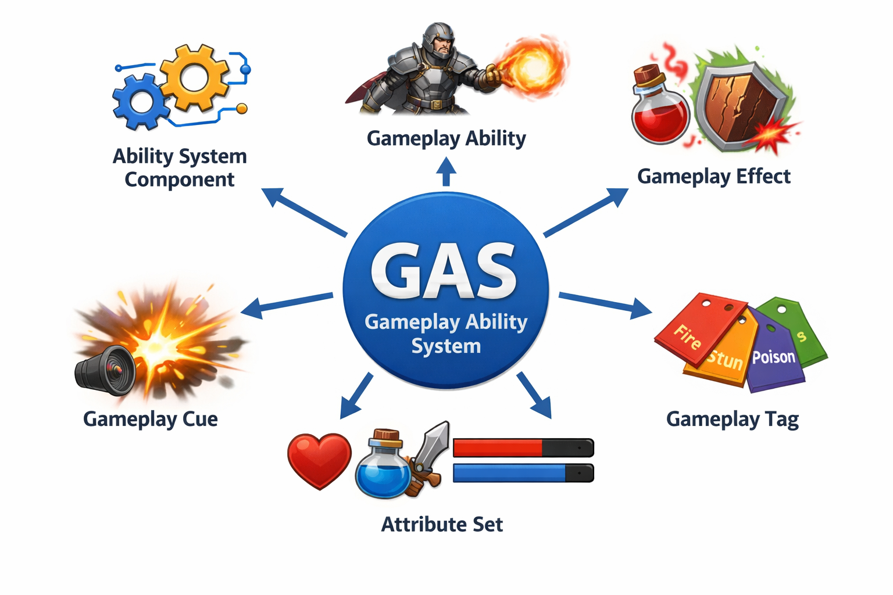

# DkRPG

This project is an **Action RPG prototype built with Unreal Engine 5** using the **Gameplay Ability System (GAS)** framework.  
The goal of this project is to implement flexible and scalable RPG mechanics such as abilities, attributes, buffs, debuffs, and combat interactions.

---

# Unreal Engine

**Unreal Engine 5** provides a powerful real-time 3D development environment used for games, simulations, and interactive experiences.

Key features used in this project:

- **C++ and Blueprint integration** for flexible gameplay programming
- **Component-based architecture** for modular gameplay systems
- **Animation system** for character actions
- **Gameplay Ability System (GAS)** for managing abilities, attributes, and gameplay effects

UE5 allows complex gameplay logic to be implemented in a structured and scalable way, which makes it well suited for RPG mechanics.

---

# Gameplay Ability System

The **Gameplay Ability System (GAS)** is a framework designed by Epic Games to implement advanced gameplay mechanics such as:

- Character abilities
- Buffs and debuffs
- Attribute modifications
- Status effects
- Network replication for multiplayer

GAS is built around several core components.

---

## Ability System Component

The **Ability System Component (ASC)** is the central manager of the Gameplay Ability System.

It is responsible for:

- Granting and activating abilities
- Applying gameplay effects
- Managing gameplay cues
- Tracking attributes
- Handling ability costs and cooldowns

Each character or actor that uses GAS typically owns an **Ability System Component**.

---

## Gameplay Ability

A **Gameplay Ability** represents an action that a character can perform.

Examples include:

- Attacking
- Casting spells
- Dodging
- Using skills

Gameplay abilities define:

- Activation conditions
- Ability costs
- Cooldowns
- Gameplay effects applied during the ability

They can be triggered by player input, AI decisions, or gameplay events.

---

## Gameplay Effect

A **Gameplay Effect** modifies attributes or applies status effects to an actor.

Examples:

- Damage
- Healing
- Speed buffs
- Poison debuffs

Gameplay effects can be:

- **Instant** (e.g., damage)
- **Duration-based** (e.g., poison)
- **Infinite** (e.g., passive stat bonuses)

They interact directly with the **Attribute Set**.

---

## Gameplay Cue

A **Gameplay Cue** handles the **visual and audio feedback** associated with gameplay events.

Examples:

- Particle effects when a spell is cast
- Sound effects when damage is applied
- Visual indicators for buffs or debuffs

Gameplay cues help separate **game logic** from **presentation**.

---

## Attribute Set

An **Attribute Set** defines the numerical attributes of a character.

Common attributes include:

- Health
- Mana
- Stamina
- Attack Power
- Defense

Attributes are modified through **Gameplay Effects** and are tracked by the **Ability System Component**.

---

# Project Goal

The goal of this project is to explore and implement a modular **Action RPG combat system** using GAS, demonstrating how abilities, attributes, and effects interact to create dynamic gameplay.